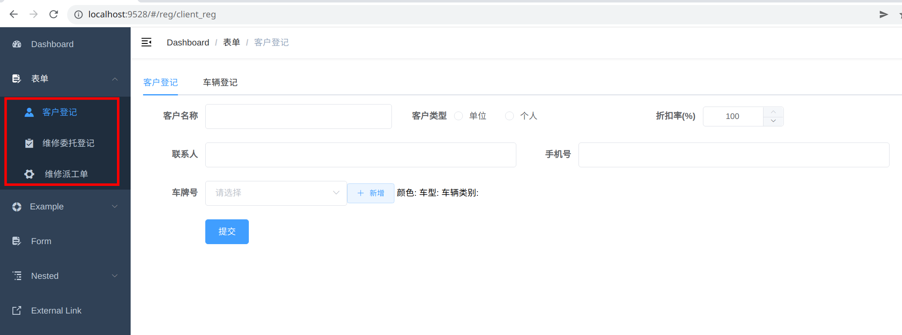
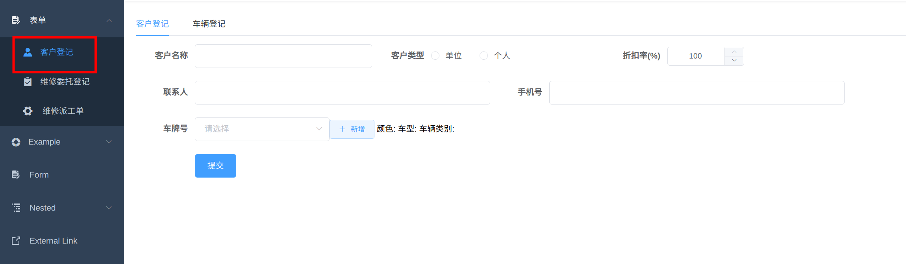
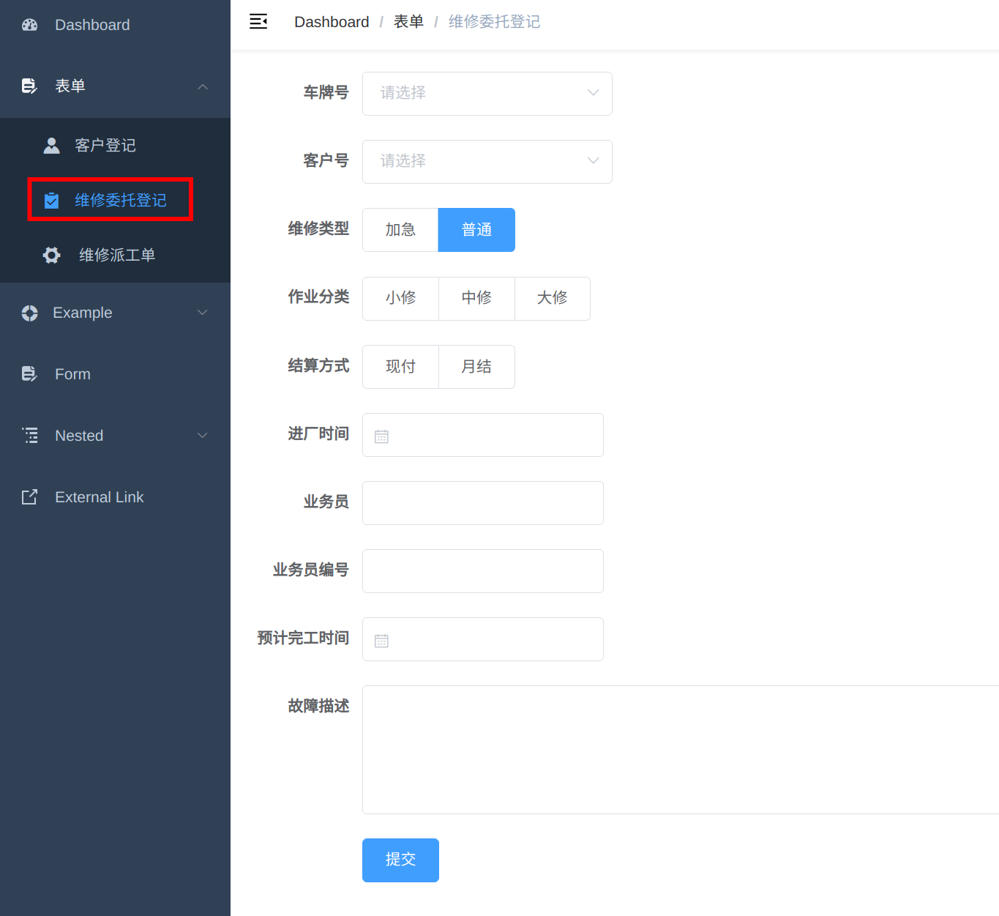
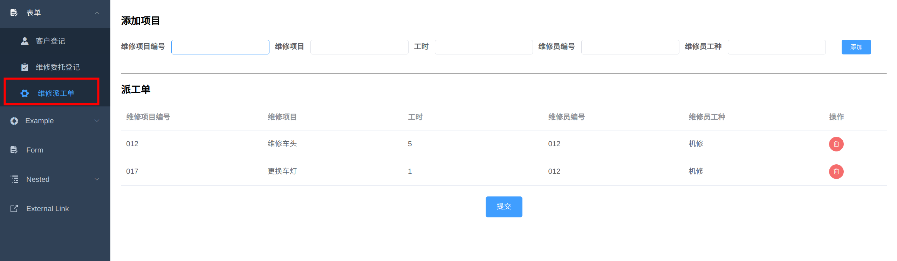

# 这是一个标题
运行前端：`npm run dev`

这三个页面是自己写的，其他页面是模板的demo



# 页面

## 客户登记

代码写在`src/views/reg/client_reg.vue`



需要后端提供接口：

- 获得数据库中已有的车辆信息
  `GET`请求，无参数
  期望的返回格式：

  ```json
  data:
  [
      { id: "沪A12345", color: "白色", series: "桑塔纳", type: "轿车" },
      { id: "沪A23456", color: "蓝色", series: "途安", type: "SUV" },
  ]
  ```

- 新增车辆信息
  `POST`请求，地址`{baseURL}/car`，参数如下

  ```json
  data:{
      "car_id":"沪A12345",
      "car_color":"白色",
      "car_series":"桑塔纳",
      "car_type":"轿车"
  }
  ```

  期望返回：成功`HTTP 200`， 失败`失败信息`

- 新增客户信息
  `POST`请求，地址`{baseURL}/client`,参数如下

  ```json
  data:{
      "client_id":"",
      "client_name":"李治平",
      "client_type":"个人",
      "discount":100,
      "contact":"李治平",
      "tel":"13661729587",
      "car_id":"沪A23456"
  }
  ```

  期望返回：成功`HTTP 200`， 失败`失败信息`

  ## 维修委托登记

  代码写在`src/views/reg/fix_reg.vue`

  

需要后端提供接口：

- 新增委托登记
  `POST`请求，参数如下：

  ```json
  data:{
      "car_id":"沪A12345",
      "client_id":"123",
      "priority":"普通",
      "type":"中修",
      "pay":"现付",
      "in_time":"2022-01-03T16:00:00.000Z",
      "clerk_name":"王波",
      "clerk_id":"01",
      "est_time":"2022-01-24T16:00:00.000Z",
      "describe":"车头损坏"
  }
  ```

  期望返回：成功`HTTP 200`， 失败`失败信息`

## 维修派工单

代码写在`src/views/reg/job_reg.vue`



需要后端提供接口：

- 新增派工单
  `POST`请求，参数如下：

  ```json
  data:[
      {
          "fix_id":"012",
           "fix_name":"维修车头",
           "time":"5",
           "worker_id":"012",
           "worker_name":"机修"
      },
      {
          "fix_id":"017",
          "fix_name":"更换车灯",
          "time":"1",
          "worker_id":"012",
          "worker_name":"机修"
      }
  ]
  ```

  期望返回：成功`HTTP 200`， 失败`失败信息`