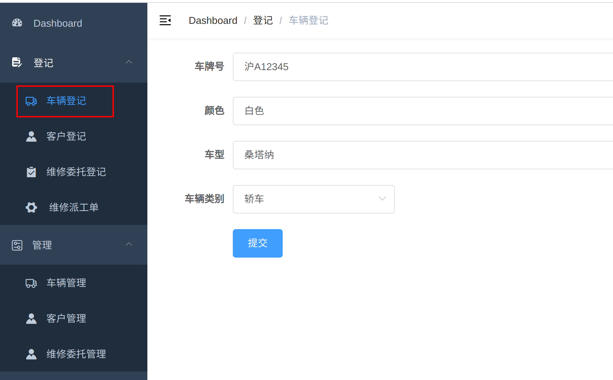
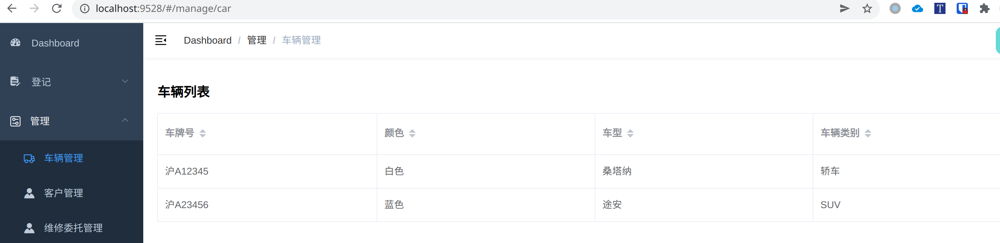
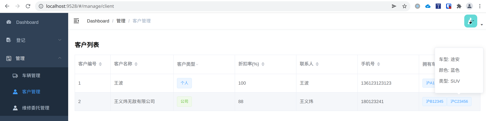
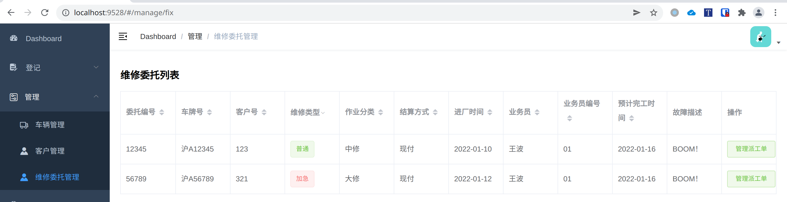

# 前端接口需求
运行前端：`npm run dev`

# 登记页面

## 车辆登记
代码写在`src/views/reg/car_reg.vue`



接口：

- 新增车辆信息
  `POST {baseURL}/car`，参数如下

  ```json
  data:{
      "car_id":"沪A12345",
      "car_color":"白色",
      "car_series":"桑塔纳",
      "car_type":"轿车"
  }
  ```

## 客户登记

代码写在`src/views/reg/client_reg.vue`


需要后端提供接口：

- 新增客户信息
  `POST {baseURL}/client`,参数如下

  ```json
  data:{
      "client_id":"",
      "client_name":"李治平",
      "client_type":"个人",
      "discount":100,
      "contact":"李治平",
      "tel":"13661729587",
      "car_id":"沪A23456"
  }
  ```

  期望返回：成功`HTTP 200`， 失败`失败信息`

  ## 维修委托登记

  代码写在`src/views/reg/fix_reg.vue`

  

需要后端提供接口：

- 新增委托登记
  `POST {baseURL}/fix`参数如下：

  ```json
  data:{
      "car_id":"沪A12345",		// <- 2. 因为可以通过车牌号找到客户
      "client_id":"123",		// <- 1. 这里可以不需要加client_id
      "priority":"普通",
      "type":"中修",
      "pay":"现付",
      "in_time":"2022-01-03T16:00:00.000Z",
      "clerk_name":"王波",
      "clerk_id":"01",
      "est_time":"2022-01-24T16:00:00.000Z",
      "describe":"车头损坏"
  }
  ```

  期望返回：成功`HTTP 200`， 失败`失败信息`

## 维修派工单

代码写在`src/views/reg/job_reg.vue`


需要后端提供接口：

- 查询工单
  `GET {baseURL}/job?fix_id={fix_id}`，期望返回：

  ```json
  data:[
      {
          "job_id":"012",
           "fix_name":"维修车头",
           "time":"5",
           "worker_id":"012",
           "worker_name":"机修"
      },
      {
          "job_id":"017",
          "fix_name":"更换车灯",
          "time":"1",
          "worker_id":"012",
          "worker_name":"机修"
      }
  ]
  ```

- 新增/修改派工单
  
  **修改和新建共用同一个接口，如果对应工单号下已有记录，则修改后上传，若无记录，则为新建**
  `POST {baseURL}/job?fix_id={fix_id}`，参数如下：
  
  ```json
  data:[
      {
          "job_id":"012",
           "fix_name":"维修车头",
           "time":"5",
           "worker_id":"012",
           "worker_name":"机修"
      },
      {
          "job_id":"017",
          "fix_name":"更换车灯",
          "time":"1",
          "worker_id":"012",
          "worker_name":"机修"
      }
  ]
  ```
  
  期望返回：成功`HTTP 200`， 失败`失败信息`

# 管理页面

## 车辆管理



接口：

- 获得数据库中已有的车辆信息
  `GET {baseURL}/cars`，期望的返回格式：
  
  ```json
  data:
  [
      { id: "沪A12345", color: "白色", series: "桑塔纳", type: "轿车" },
      { id: "沪A23456", color: "蓝色", series: "途安", type: "SUV" },
  ]
  ```

## 客户管理



接口：

- 获取数据库中客户信息
  `GET {baseURL}/client`，返回格式：

  ```json
  data:[
          {
              client_id: '1',
              client_name: '王波',
              client_type: '个人',
              discount: '100',
              contact: '王波',
              tel: '136123123123',
              cars: [
                  { id: "沪A12345", color: "白色", series: "桑塔纳", type: "轿车" },
                  { id: "沪A23456", color: "蓝色", series: "途安", type: "SUV" },
              ]
          },
          {
              client_id: '2',
              client_name: '王义炜无敌有限公司',
              client_type: '公司',
              discount: '88',
              contact: '王义炜',
              tel: '180123241',
              cars: [
                  { id: "沪B12345", color: "白色", series: "桑塔纳", type: "轿车" },
                  { id: "沪C23456", color: "蓝色", series: "途安", type: "SUV" },
              ]
          }
      ]
  ```

  ## 维修委托管理

  

接口：

- 获取维修委托单信息
  `GET {baseURL}/fix`，数据格式：

  ```json
  data:[
      {
          "fix_id": "12345",
          "car_id": "沪A12345",
          "client_id": "123",
          "priority": "普通",
          "type": "中修",
          "pay": "现付",
          "in_time": "2022-01-10",
          "clerk_name": "王波",
          "clerk_id": "01",
          "est_time": "2022-01-16",
          "describe": "BOOM！"
      },
      {
          "fix_id": "56789",
          "car_id": "沪A56789",
          "client_id": "321",
          "priority": "加急",
          "type": "大修",
          "pay": "现付",
          "in_time": "2022-01-12",
          "clerk_name": "王波",
          "clerk_id": "01",
          "est_time": "2022-01-16",
          "describe": "BOOM！"
      },
  ]
  ```

  
